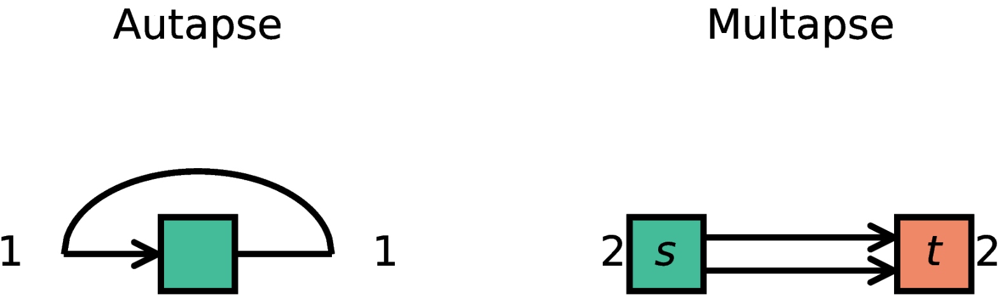
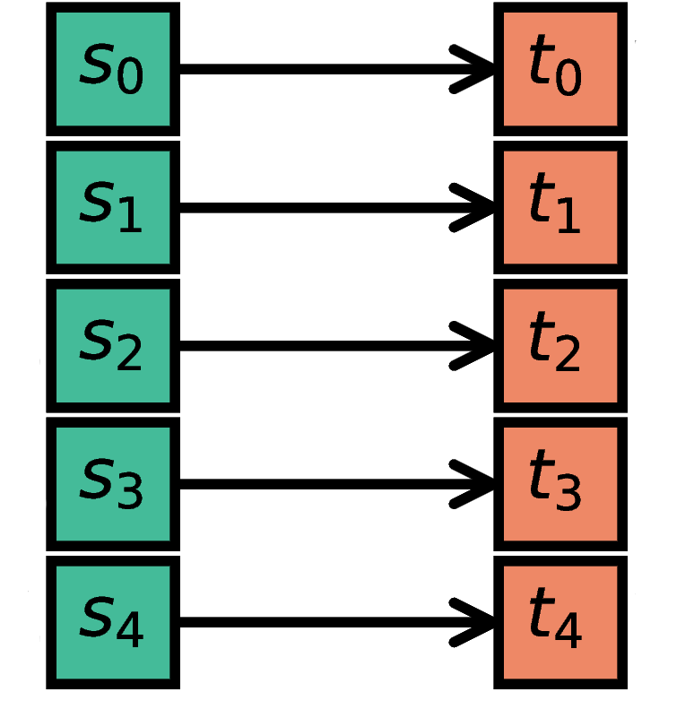
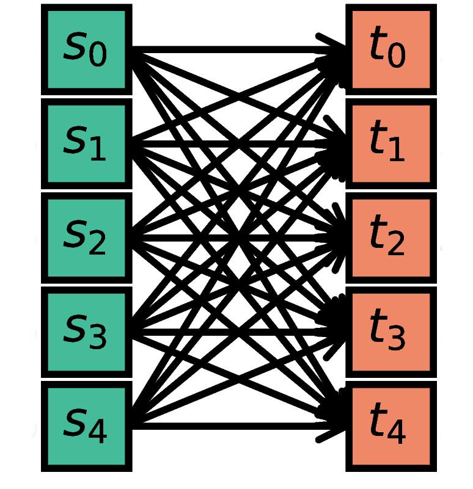
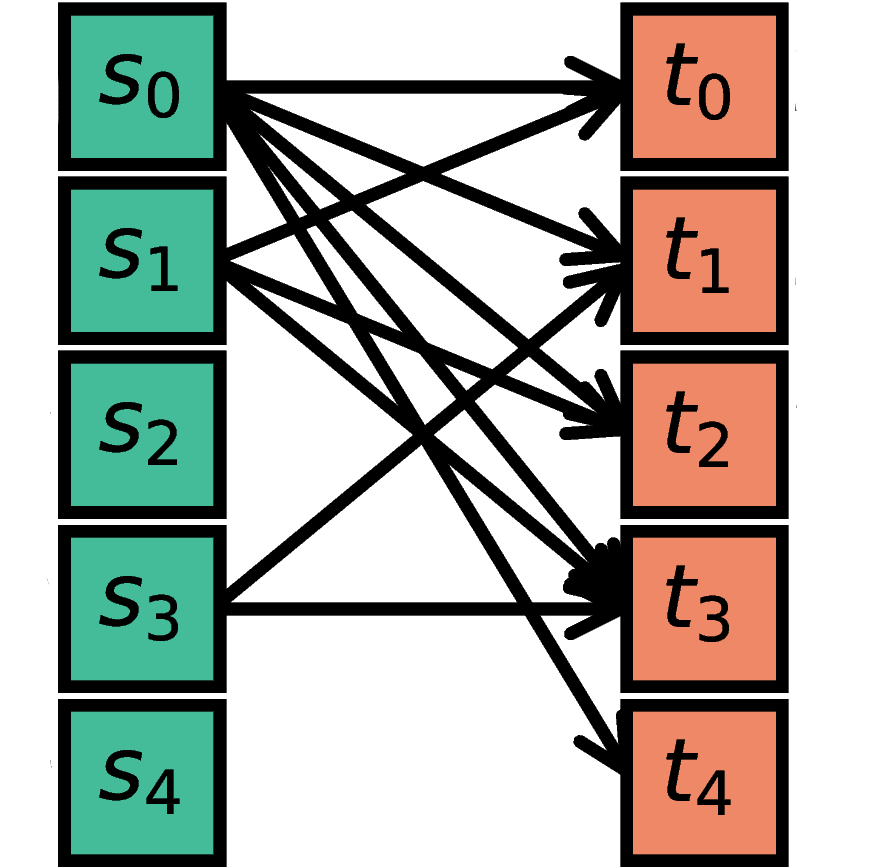
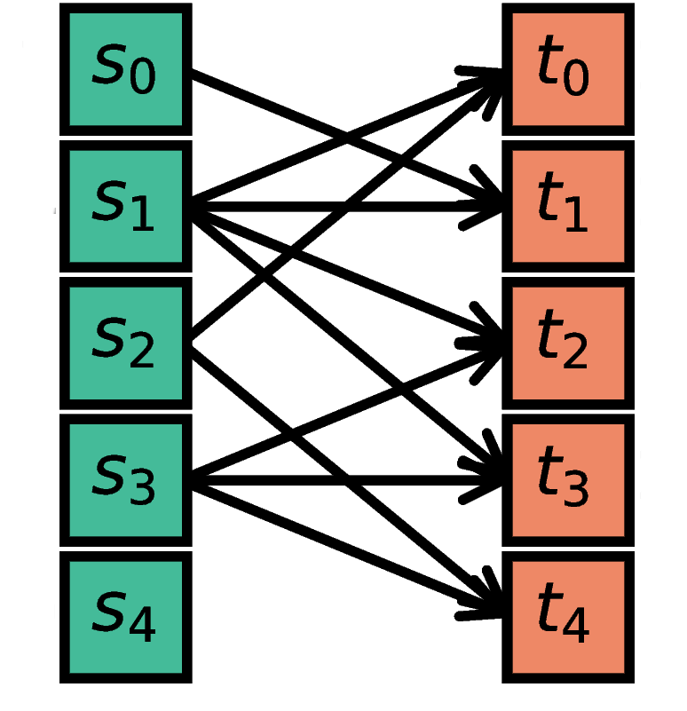
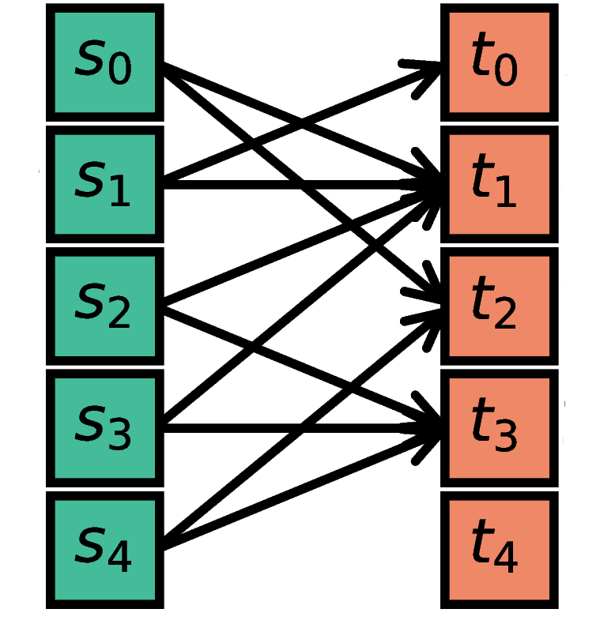

.. _connectivity_concepts:

Network connectivity with NEST GPU
==================================

.. grid:: 2 2 6 6
    :gutter: 0

    .. grid-item-card:: Autapse and multapse
	  :link: autapse_multapse
	  :link-type: ref
	  :img-top: ../static/img/connectivity_patterns/Autapse_multapse_v.png

    .. grid-item-card:: One to one
	  :link: one_to_one
	  :link-type: ref
	  :img-top: ../static/img/connectivity_patterns/One_to_one.png

    .. grid-item-card:: All to all
	  :link: all_to_all
	  :link-type: ref
	  :img-top: ../static/img/connectivity_patterns/All_to_all.png

    .. grid-item-card:: Fixed total number
	  :link: fixed_total_number
	  :link-type: ref
	  :img-top: ../static/img/connectivity_patterns/Fixed_total_number.png

    .. grid-item-card:: Fixed in-degree
	  :link: fixed_indegree
	  :link-type: ref
	  :img-top: ../static/img/connectivity_patterns/Fixed_indegree.png

    .. grid-item-card:: Fixed out-degree
	  :link: fixed_outdegree
	  :link-type: ref
	  :img-top: ../static/img/connectivity_patterns/Fixed_outdegree.png

.. rst-class:: center

    Connection rules available in NEST GPU. For more details, go to the section :ref:`conn_rules` or just click on one of the illustrations.

NEST GPU provides high-level routines for connecting source and target neuron
populations.
The underlying connectivity concepts are the same as in NEST CPU; this guide
therefore does not restate them but explains how they are expressed in NEST GPU
and where NEST GPU deviates.
It builds on the two main references for connectivity concepts and connection
rules in NEST CPU:

* the *permanent reference*: the article "Connectivity concepts in neuronal
  network modeling" :footcite:p:`Senk2022`, which we suggest to cite if the
  rules defined there are used;
* the *living reference*: the section :ref:`nest:connectivity_concepts` of the
  NEST Simulator documentation, which is kept up to date and to which each rule
  below links for its mathematical details.

We use the term `connection` for a single, atomic edge between network nodes,
and `projection` for a group of edges connecting two populations.
Each projection is specified by a triplet of source population, target
population, and a `connection rule`.

Projections are created in NEST GPU with the ``Connect`` function:

.. code-block:: python

   nestgpu.Connect(source, target, conn_dict, syn_dict)

All four arguments are positional and required.
Unlike in NEST CPU, there is no default rule, no keyword form, and
``conn_dict`` cannot be abbreviated to a bare rule name.
``source`` and ``target`` are ``NodeSeq`` objects as returned by ``Create``, or
lists or tuples of node indices; they are not ``NodeCollections`` as in NEST
CPU.

Note: An empty ``syn_dict`` dictionary initializes both
``weight`` and ``delay`` to ``0``, but only the delay raises an error for
the attempt to set a value smaller than the simulation resolution.

Connections are established dynamically during runtime as described in
:footcite:p:`Golosio2023` for single-GPU and in :footcite:p:`Golosio2026` for
multi-GPU simulations.
For connections between nodes on different MPI processes, see the separate
guide :doc:`multigpu_simulations`, which covers the ``RemoteConnect``
function.

As a sanity check, you can inspect the connections after having run ``nestgpu.Calibrate()``;
during calibration, the connections are ordered and the data structures initialized
to prepare for the state propagation:

.. code-block:: python

   conn = nestgpu.GetConnections(source, target) # returns a ConnectionList object
   print(len(conn))
   print(nestgpu.GetConnectionStatus(conn))

.. _conn_rules:

Connection rules
----------------

NEST GPU implements :ref:`deterministic_rules` and :ref:`probabilistic_rules`
as detailed below.
Each rule is given with a definition and a code example, and links to its
mathematical details in the living reference.

The following rules of NEST CPU are currently not available in NEST GPU:

* :ref:`nest:pairwise_bernoulli` and its symmetric variant,
* :ref:`nest:pairwise_poisson`,
* the third-factor rule :ref:`nest:tripartite_connectivity`.

NEST GPU also has no counterpart to the :ref:`nest:connection_generator` and no
connection rules for :ref:`nest:spatial_networks`.

.. _autapse_multapse:

Autapses and multapses
----------------------

Autapses are self-connections of a node and multapses are multiple connections
between the same pair of nodes.

NEST GPU always allows both, because the probabilistic rules draw node indices
uniformly with replacement.
``conn_dict`` has no ``allow_autapses`` and ``allow_multapses`` switches as in
NEST CPU, so this cannot be turned off.
The mathematical details of the rules below therefore always apply in their
"with multapses" variant.

.. _deterministic_rules:

Deterministic connection rules
------------------------------

Deterministic connection rules establish precisely defined sets of connections
without any variability across network realizations.

.. _one_to_one:

One-to-one
~~~~~~~~~~

The `i`\-th node in ``S`` (source) is connected to the `i`\-th node in ``T``
(target).
``S`` and ``T`` must contain the same number of nodes, otherwise ``Connect``
raises an error.

.. code-block:: python

   n = 5
   S = nestgpu.Create('iaf_psc_alpha', n)
   T = nestgpu.Create('iaf_psc_alpha', n)
   nestgpu.Connect(S, T, {'rule': 'one_to_one'}, {'weight': 1.0, 'delay': 1.0})

Mathematical details: :ref:`nest:one_to_one`

.. _all_to_all:

All-to-all
~~~~~~~~~~

Each node in ``S`` is connected to every node in ``T``.
In contrast to NEST CPU, ``all_to_all`` is not a default and has to be
specified explicitly.

.. code-block:: python

   n, m = 5, 5
   S = nestgpu.Create('iaf_psc_alpha', n)
   T = nestgpu.Create('iaf_psc_alpha', m)
   nestgpu.Connect(S, T, {'rule': 'all_to_all'}, {'weight': 1.0, 'delay': 1.0})

Mathematical details: :ref:`nest:all_to_all`

Explicit connections
~~~~~~~~~~~~~~~~~~~~

Connections between explicit lists of source-target pairs are realized by
passing lists of node indices to the :ref:`one_to_one` rule.
Node indices are counted from ``0``.

.. code-block:: python

   n, m = 5, 5
   S = nestgpu.Create('iaf_psc_alpha', n)  # node indices: 0..4
   T = nestgpu.Create('iaf_psc_alpha', m)  # node indices: 5..9
   # source-target pairs: (2,7), (3,5), (0,8)
   nestgpu.Connect([2, 3, 0], [7, 5, 8], {'rule': 'one_to_one'},
                   {'weight': 1.0, 'delay': 1.0})

.. _probabilistic_rules:

Probabilistic connection rules
------------------------------

Probabilistic connection rules establish edges according to a probabilistic rule. Consequently, the exact connectivity varies with realizations. Still, such connectivity leads to specific expectation values of network characteristics, such as degree distributions or correlation structure.

.. _fixed_total_number:

Random, fixed total number
~~~~~~~~~~~~~~~~~~~~~~~~~~

The nodes in ``S`` are randomly connected with the nodes in ``T`` such that the total number of connections equals ``total_num``.
In NEST CPU, this parameter is called ``N``.

.. code-block:: python

   n, m, N = 5, 5, 10
   S = nestgpu.Create('iaf_psc_alpha', n)
   T = nestgpu.Create('iaf_psc_alpha', m)
   conn_dict = {'rule': 'fixed_total_number', 'total_num': N}
   nestgpu.Connect(S, T, conn_dict, {'weight': 1.0, 'delay': 1.0})

Mathematical details: :ref:`nest:fixed_total_number`, in the variant with
multapses.

.. _fixed_indegree:

Random, fixed in-degree
~~~~~~~~~~~~~~~~~~~~~~~

The nodes in ``S`` are randomly connected with the nodes in ``T`` such that each node in ``T`` has a fixed ``indegree`` of ``N``.

.. code-block:: python

   n, m, N = 5, 5, 2
   S = nestgpu.Create('iaf_psc_alpha', n)
   T = nestgpu.Create('iaf_psc_alpha', m)
   conn_dict = {'rule': 'fixed_indegree', 'indegree': N}
   nestgpu.Connect(S, T, conn_dict, {'weight': 1.0, 'delay': 1.0})

Mathematical details: :ref:`nest:fixed_indegree`, in the variant with
multapses.

.. _fixed_outdegree:

Random, fixed out-degree
~~~~~~~~~~~~~~~~~~~~~~~~

The nodes in ``S`` are randomly connected with the nodes in ``T`` such that each node in ``S`` has a fixed ``outdegree`` of ``N``.

.. code-block:: python

   n, m, N = 5, 5, 2
   S = nestgpu.Create('iaf_psc_alpha', n)
   T = nestgpu.Create('iaf_psc_alpha', m)
   conn_dict = {'rule': 'fixed_outdegree', 'outdegree': N}
   nestgpu.Connect(S, T, conn_dict, {'weight': 1.0, 'delay': 1.0})

Mathematical details: :ref:`nest:fixed_outdegree`, in the variant with
multapses.

References
----------

.. footbibliography::
